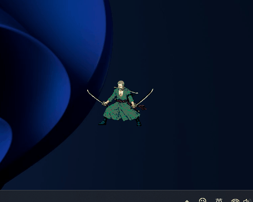
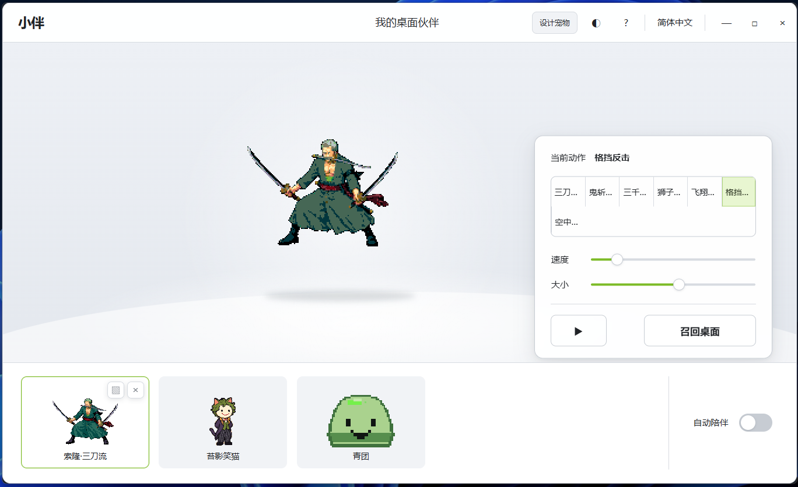
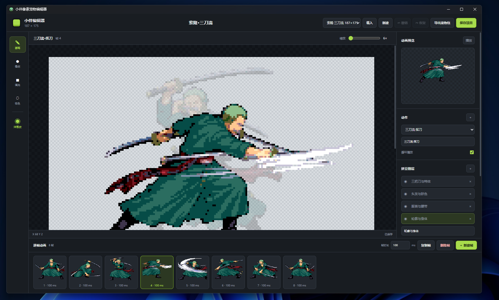

# EP Baby

EP Baby 是一款将“桌面陪伴”与“像素创作”结合起来的桌面宠物应用。它不是一段固定播放的悬浮动画，而是一套可以被观察、互动、调教和重新创作的小型宠物系统：宠物会在桌面上随机切换待机、移动或表演动作，沿着屏幕行走，在碰到边缘时转身，也会对点击、长按、拖动、滚轮、连续输入和全局快捷键作出不同回应。

项目同时内置了一套像素动画编辑器。用户可以从空白画布开始绘制自己的宠物，组织调色板与图层，为它添加多个动作和不同持续时间的动画帧，再立即把保存后的工程切换成桌面上真正运行的宠物。编辑、预览、保存、运行和导出都在同一个应用内完成，形成了一个从角色设计到桌面陪伴的完整创作闭环。

EP Baby 当前是主要面向 Windows 的本地原型，基于 Electron、Vue 3、TypeScript 和 Canvas 2D 实现，内置史莱姆、苔藓小丑猫和三刀流角色三个风格不同的示例工程。项目无需账号和远程服务，设置与可编辑工程均保存在本机 Electron `userData` 目录。

## 项目亮点

### 它真的“生活”在桌面上

宠物窗口透明、无边框、始终置顶，并且只在宠物实际绘制出的非透明像素上接收鼠标事件。鼠标经过宠物周围的透明区域时，点击会继续落到后面的桌面或应用上；碰到宠物身体时，它才变得可交互。这种像素级命中检测让宠物看起来不是住在一个透明矩形窗口里，而是直接站在桌面上。

宠物的移动也不是 CSS 位移动画：Electron 主进程会真实改变操作系统窗口坐标。它能够识别当前屏幕的可用工作区、在边缘自动转身，并通过“行进方向前缘”判断是否正在跨越显示器，因此在多屏环境中也可以自然行走。

### 同一个动作，因为操作方式不同而被触发

互动并不局限于一个“点击播放动画”的按钮。单击、双击、三击、长按、向上或向下滚轮、拖动释放都属于不同的互动语义；在控制台或编辑器中快速输入时，宠物甚至会察觉到输入节奏并触发表演类动作。输入检测只计算可打印字符数量，不记录具体内容。

互动与动作之间没有写死为某个示例角色专用的编号。系统会根据动作 ID 和名称里的中英文关键词寻找适合的反应，例如将“表演”动作分配给双击，将“休息”动作分配给长按；没有匹配项时再从合适的非移动动作中稳定回退。这意味着新创建的宠物只要合理命名动作，就能自然接入现有互动系统。

### 宠物不是素材，而是可编辑工程

每个宠物都以结构化 JSON 工程保存，其中包含逻辑画布、索引调色板、图层、动作、动画帧、帧时长、图层 cel、偏移和 pivot。桌面运行时直接解释这份工程，而不是只播放预先导出的 GIF 或精灵图。因此，在编辑器中修改动作并保存后，正在运行的宠物可以收到工程变更通知并重新加载。

编辑器支持像素画常用的画笔、橡皮、吸色、洪水填充、洋葱皮和逐帧预览，也支持图层与动作组织、画布锚点调整以及细粒度撤销/重做。完成的项目还能导出为透明 PNG 帧和 `manifest.json`，便于继续用于其他运行时或素材流程。

### 小而完整的桌面应用架构

项目用三个独立 Vue 应用分别承担宠物、控制台和编辑器，而 Electron 主进程集中管理系统能力和权威状态。它包含托盘常驻、单实例锁、全局快捷键、窗口隐藏与召回、本地持久化、默认工程迁移、跨窗口状态广播和受信 IPC 校验等桌面软件需要的完整环节。

渲染进程启用了沙箱与上下文隔离，只能通过 preload 暴露的有限类型化 API 请求系统能力。Canvas 绘制、动作选帧和工程规范化又被拆成与 Vue 组件相对独立的模块，使这个项目既是一个有趣的桌面玩具，也是一份规模适中、职责清晰的 Electron 多窗口应用示例。

## 项目示例

### 桌面宠物动作

宠物以透明置顶窗口直接显示在桌面上。下面的示例展示了三刀流角色的连续像素动画；实际运行时，角色还可以在桌面移动、响应互动并根据前进方向自动翻转。



### 宠物控制台

控制台是宠物库和运行状态的统一入口。主舞台会实时预览当前动作，右侧可以切换动作、调整播放速度与显示大小、暂停活动或召回宠物，底部则用于浏览和切换不同的宠物工程。



### 像素宠物编辑器

编辑器采用适合逐帧像素创作的工作区布局：中央是支持缩放和洋葱皮的绘制画布，右侧集中管理动作与图层，底部时间轴展示动画帧，预览区域可以随时检查动作效果。编辑完成并保存后，同一份工程即可直接成为正在桌面运行的宠物。



## 功能概览

- 透明、无边框、置顶、跨工作区显示的桌面宠物窗口
- 多宠物工程，以及由多个动作和逐帧动画组成的宠物模型
- 自动动作切换、桌面水平移动、边缘转向和多显示器移动
- 单击、双击、三击、长按、拖放、滚轮和输入节奏互动
- 控制台内切换宠物与动作，并调整自动模式、暂停、速度和显示尺寸
- 系统托盘、召回宠物、全局快捷键和单实例运行
- 像素编辑器内管理动作、帧、图层、调色板、封面和画布
- 画笔、橡皮、区域填充、吸色、洋葱皮、预览、撤销与重做
- 将工程导出为 `manifest.json` 和透明 PNG 帧组成的宠物包

## 技术栈

| 层级 | 技术 | 用途 |
| --- | --- | --- |
| 桌面容器 | Electron | 窗口、托盘、全局快捷键、屏幕坐标、文件系统与进程间通信 |
| 界面 | Vue 3、Composition API | 宠物窗口、控制台和编辑器三个独立应用 |
| 状态扩展 | Pinia | 每个 Vue 应用均挂载独立实例，便于后续拆分界面状态 |
| 绘制 | Canvas 2D | 像素帧合成、动画播放、缩略图和编辑画布 |
| 语言 | TypeScript | 跨主进程、预加载脚本和渲染进程的共享类型 |
| 构建 | Vite、tsup | 分别构建三个渲染入口，以及 Electron 主进程和 preload |

## 实现架构

```text
┌──────────────── Electron 主进程 ────────────────┐
│ 窗口 / 托盘 / 快捷键 / 行为调度 / 桌面移动       │
│ StateStore             EditorProjectStore       │
│ pet-state.json         editor-projects/*.json   │
└──────────────────────┬──────────────────────────┘
                       │ 受限且有类型的 IPC
                 contextBridge / preload
                       │
       ┌───────────────┼────────────────┐
       ▼               ▼                ▼
  宠物 Vue 应用     控制台 Vue 应用     编辑器 Vue 应用
  Canvas 动画       项目与状态管理      像素绘制与工程编辑
```

### 1. Electron 主进程

`src/main/index.ts` 是运行时中枢，负责：

- 创建固定为 `280 × 260` 的透明宠物窗口、控制台窗口和编辑器窗口；
- 维护当前宠物、动作、方向、速度、缩放、暂停状态和窗口位置；
- 以定时器调度自动动作，并以 50 ms 的移动循环更新行走动作的位置；
- 使用 Electron `screen` API 将位置约束在工作区内，同时允许宠物跨显示器移动；
- 注册托盘菜单、全局快捷键、单实例锁和全部 IPC handler；
- 读写用户设置、宠物工程及导出文件。

控制台和编辑器关闭时只隐藏窗口，托盘应用会继续运行；真正退出时才注销快捷键、停止定时器并立即落盘状态。

### 2. Preload 安全边界

`src/preload/index.ts` 通过 `contextBridge` 只暴露 `window.desktopPet`。渲染页面不能直接访问 Node.js 或 Electron API，而是调用 `DesktopPetApi` 中声明的有限接口。三个窗口均启用：

```text
nodeIntegration: false
contextIsolation: true
sandbox: true
```

主进程还会核对 IPC 消息的发送窗口。例如，运行时精简工程只允许宠物窗口读取，导出只允许编辑器发起，窗口控制只接受控制台请求。

### 3. 三个渲染应用

- `PetApp.vue`：加载精简后的运行时工程，通过 `requestAnimationFrame` 播放 Canvas 动画，完成像素级命中检测、鼠标穿透、拖动和互动手势识别。
- `ControlApp.vue`：展示项目库和当前宠物舞台，修改运行状态、选择封面、删除项目，并可打开编辑器。
- `EditorApp.vue`：管理动作、帧、图层和调色板，实现绘制工具、动画预览、工程保存及 PNG 导出。

三个入口由 Vite 作为独立 HTML 页面构建，共享 `src/shared` 中的数据契约和 `src/renderer/lib/project-renderer.ts` 中的绘制算法。

## 实现原理

### 状态与数据流

主进程是运行时状态的唯一权威来源。控制台或宠物窗口通过 IPC 发出操作，主进程校验并更新 `settings`/`currentActionId`，然后向宠物窗口和控制台广播 `pet:state-changed`。工程保存后，主进程刷新内存缓存，并向三个窗口广播 `editor:project-changed`。

```text
用户操作 → renderer → preload API → IPC → 主进程更新
                                           │
                                           ├─ 延迟写入本地状态
                                           └─ 广播快照 → 各 renderer 重绘
```

持久化设置采用 250 ms 防抖，避免移动时频繁写盘；程序退出时执行同步保存。工程保存采用“写入 `.tmp` 后重命名”的方式，降低写入中断导致工程损坏的风险。

### 像素工程模型

工程格式版本当前为 `1`，最大逻辑画布为 `192 × 192`。核心层级如下：

```text
EditorProject
├─ canvas / palette / layers
├─ actions[]
│  └─ frames[]
│     ├─ durationMs / pivot
│     └─ cels[layerId]
│        └─ pixels[] / offsetX / offsetY
└─ cover: actionId + frameId
```

`pixels` 保存调色板索引，而不是完整 RGBA 值；索引 `0` 固定为透明色。同一帧按图层顺序读取 cel，结合图层可见性和透明度合成图像。这种结构可以复用调色板、独立移动图层，并使 JSON 工程保持可读和可迁移。

读取工程时，`normalizeEditorProject` 会修正画布范围、时长、透明度、颜色索引、缺失图层 cel 和无效封面引用。因此内置项目与用户项目进入运行时前都会得到统一结构。

### 动画渲染

`frameAtElapsed` 将经过速度倍率修正的已用时间映射到当前帧：循环动作对总时长取模，非循环动作停留在最后一帧。`drawProjectFrame` 根据逻辑画布和目标 Canvas 计算整数像素倍率，关闭图像平滑，然后逐图层、逐像素绘制，因此缩放后仍保持清晰的像素边缘。

宠物方向由主进程维护。向左移动时，渲染器通过 Canvas 变换水平翻转画面，无需为左右方向保存两套帧。控制台预览复用相同的动作选帧与绘制模块。

### 自动行为与桌面移动

自动模式从动作池随机选择下一动作，并额外放入两份首动作，使默认/待机动作有更高概率出现；下一次选择时间由该动作所有帧的时长总和除以播放速度决定。

只有动作 ID 或名称匹配移动关键词（如 `walk`、`run`、`行走`、`冲刺`）时，主进程才移动窗口。移动速度基准为每秒 56 像素，并乘以用户速度。到达当前屏幕工作区边缘后方向反转；判断跨屏时使用宠物前缘所在显示器，避免窗口中心尚未越界时被提前夹回原屏幕。

### 互动匹配

宠物 Canvas 会读取鼠标位置像素的 Alpha 值。透明区域保持鼠标穿透，只有落在可见像素上的事件才会捕获，从而兼顾桌面操作和宠物互动。

互动动作优先根据动作 ID/名称中的中英文关键词匹配。例如双击倾向于 `show`/`pose`/“表演”，长按倾向于 `sleep`/`idle`/“休息”。没有命中时，会从非移动、非首动作中按互动类型稳定选择一个回退动作。动作结束后自动调度恢复。

手势判定细节：

- 单击/双击/三击使用 320 ms 点击聚合窗口；
- 按住至少 650 ms 且未明显移动视为长按；
- 累计拖动距离达到 8 像素，释放时触发拖放动作；
- 滚轮互动有 450 ms 节流；
- 控制台或编辑器中 8 秒内输入 20 个可打印字符会触发表演类动作，只统计次数，不保存按键内容。

### 编辑、历史与导出

连续画笔/橡皮操作只记录发生变化的像素及其前后值；添加图层、动作等结构性操作则保存修改前后的工程快照。撤销/重做历史默认最多 120 条，新编辑会清空 redo 栈。区域填充采用四方向洪水填充，吸色按图层逆序查找最上方可见颜色。

导出时，编辑器在内存 Canvas 中逐帧合成透明 PNG，并把 Data URL 与 manifest 交给主进程。主进程清理目录名、限制最多 2000 张图片、拒绝绝对路径和 `../` 路径，再写入用户选择的目录；若同名目录存在，会自动追加数字后缀。

## 实现细节

### 本地数据与内置项目迁移

数据位于 Electron `app.getPath("userData")` 返回的目录：

```text
pet-state.json                 当前宠物、自动模式、暂停、速度、缩放和位置
editor-projects/<id>.json      可编辑宠物工程
editor-projects/.*             内置项目迁移与用户删除标记
```

启动时会按迁移标记安装或更新 `default-pets/` 中的内置工程。用户主动删除内置宠物后会留下删除标记，后续启动不会无条件把它重新添加回来。主进程还将完整工程压缩为使用 `Uint8Array` 像素数据、去掉编辑元数据的运行时对象，并按项目 ID 缓存；工程保存或删除时对应缓存失效。

### 画布尺寸调整

调整画布时支持九宫格锚点。实现会根据锚点计算新旧画布的偏移，将每个 cel 的已有偏移一起烘焙到新的像素数组，再把 cel 偏移归零；越过新边界的像素会被裁剪，pivot 则被移动并限制在新画布内。

### 构建产物

- tsup 将 `src/main/index.ts` 与 `src/preload/index.ts` 编译成 Node 22 目标的 CommonJS 文件，输出到 `dist/electron/`；
- Vite 构建 `pet.html`、`control.html`、`editor.html` 三个入口到 `dist/renderer/`；
- Vite 构建结束时把 `default-pets/` 复制到渲染产物中，供生产模式首次启动时安装默认工程。

## 目录结构

```text
default-pets/                  随应用分发的默认宠物 JSON
scripts/                       默认宠物生成、素材切片与预览脚本
src/main/                      Electron 主进程、设置与工程存储
src/preload/                   contextBridge API
src/shared/                    IPC 契约、工程模型和共享规则
src/renderer/
├─ pet/                        桌面宠物应用
├─ control/                    控制台应用
├─ editor/                     像素编辑器及历史记录
├─ components/                 共享 Vue 组件
├─ lib/                        Canvas 渲染与输入互动逻辑
└─ styles/                     三个应用的样式
reference/                     角色和动作参考素材
design/                        界面设计稿
artifacts/                     生成的动作预览产物
```

## 开发与运行

要求 Node.js 22 或更高版本。当前开发脚本和素材切片脚本使用 PowerShell，因此建议在 Windows 环境运行。

项目将 Electron 固定为 `42.3.0`，而非跟随 `latest`。Electron 43 的安装器改用了原生解压模块，该模块可能被部分 Windows 应用控制策略拦截并导致 `ERR_DLOPEN_FAILED`；升级 Electron 前应先在目标 Windows 环境验证安装流程。

```powershell
cd D:\code\project\epBaby
npm install
npm run dev
```

`npm run dev` 会构建主进程与 preload，启动 Vite 开发服务器，随后启动 Electron。生产模式构建并运行：

```powershell
npm run start
```

仅进行类型检查或完整构建：

```powershell
npm run typecheck
npm run build
```

当前仓库未配置安装包生成器；`npm run build` 产出可运行构建到 `dist/electron` 和 `dist/renderer`，但不会生成安装程序。

## 操作方式

### 宠物互动

- 单击、双击、三击：触发不同互动动作；
- 长按 650 ms：触发休息类动作；
- 拖动后释放：移动宠物并触发落地类动作；
- 滚轮向上/向下：分别触发空中类/下蹲类动作；
- 右键宠物：打开控制台。

### 全局快捷键

| 快捷键 | 功能 |
| --- | --- |
| `Ctrl+Alt+1/2/3` | 触发当前宠物的第 2/3/4 个动作，不存在时回退到首动作 |
| `Ctrl+Alt+R` | 将宠物召回鼠标指针附近 |
| `Ctrl+Alt+P` | 暂停或继续活动 |

macOS 下 Electron 会将 `CommandOrControl` 映射为 Command，但项目当前主要按 Windows 环境开发和验证。

### 编辑器快捷键

| 快捷键 | 功能 |
| --- | --- |
| `B` / `E` / `G` / `I` | 画笔 / 橡皮 / 填充 / 吸色 |
| `Ctrl+Z` / `Ctrl+Y` | 撤销 / 重做 |
| `Ctrl+S` | 保存工程 |

## 素材工具

重新切片精灵图：

```powershell
npm run sprites:slice
```

重新生成全部默认宠物 JSON：

```powershell
npm run pet:generate-default
```

生成脚本会直接更新 `default-pets/` 下的内置工程，运行前请确认这些变更符合预期。
